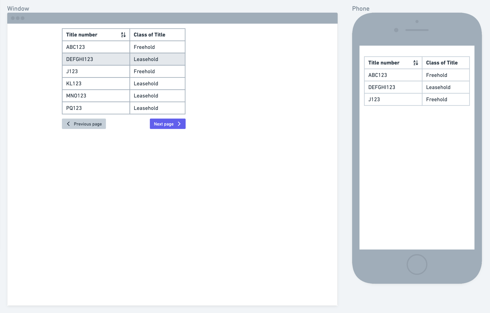

# Orbital Witness Technical Task

This document contains instructions for candidates to follow as part of the Orbital Witness Technical Assessment. We look forward to your submission.

# Objective
At Orbital Witness, we deal with a variety of data formats and structures. One of them is data on [titles](https://eservices.landregistry.gov.uk/eservices/FindAProperty/view/resources/example_register.pdf) from the Land Registry. In this assessment, we have provided a small sample of the data we deal with on a day-to-day basis.

## User Story
**AS A** user of the app you create\
**I WANT** to browse through a list of Land registry titles\
**SO THAT** I can efficiently look through the details of each title

# Instructions
To complete the task you need to create an app based on [these wireframes](https://github.com/orbitalwitness/tech-test/tree/main/wireframes).

## Functionality
App will load and display a table of available titles. The title data is available from the hosted [API](https://owfetechtask.blob.core.windows.net/titledata/testdata.json). The table should be sortable and include pagination.

Clicking on a title within the table with take the user to a title details page that displays all the known data for the selected titles, including a map of the title's location. The map should include a pin and be zoomed appropriately to show where the title is located.

## Titles page

Show wireframe

#### List of titles and title details

 - This page contains a table of titles. It must be paginated and you should display 5 titles on every page. 
 - The user should be able to share the url to colleagues and see the same results.
 - Hovering over a row turns it grey and click on it opens the titles details page.
 - On click of the table header cell, you should sort the column's data. First click sorts it ascending, second click sorts it descending and a third click returns to it's original sort order.

## Title details page

Show wireframe

#### List of titles and title details

 - This page shows all the details of the selected title. 
 - The user should be able to share the url to colleagues and see the same results.
 - A map is included that shows the location of the title with a pin to mark the position and zoomed/panned appropriately so that the selected title is visible.
 - There should be a back button to return to the list of titles.

## What you should focus on
- This task can be completed with any frontend framework, although Orbital Witness uses VueJS so is the preferred framework.
- Don’t hack anything just because it’s a small app. Imagine that you’re creating a new feature for your commercial project.
- Let us know in the README how we can start the app.
- The designs are based on the 8pt grid.
- CLEAN CODE! **You don’t need to implement everything, but whatever you do implement should showcase your best work**.
- Responsive design! Care about widths from 375px to 1280px. It should look appropriate on all of those widths.
- Your code should ship with unit tests.
- We love automated tests as well :)
- We don’t care about the icons, but they should be consistent across the app. Possible use https://fonts.google.com/icons?selected=Material+Icons? Again, whatever source you have is fine.
- The wireframes are not designs. Feel free to add your own design flair to the pages.

## Finally

Good luck and have fun with this task! 🚀
